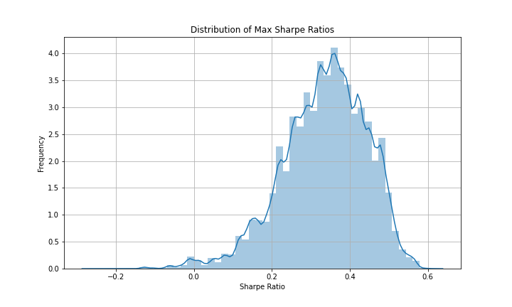
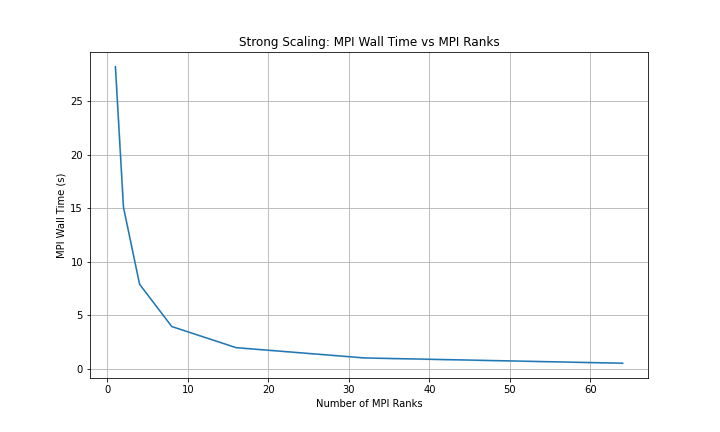
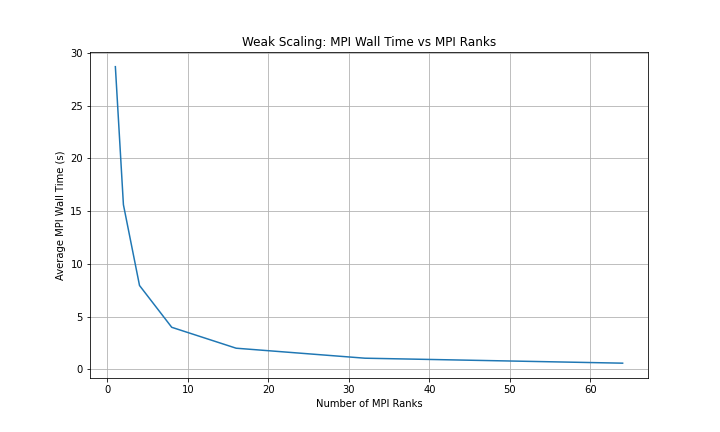
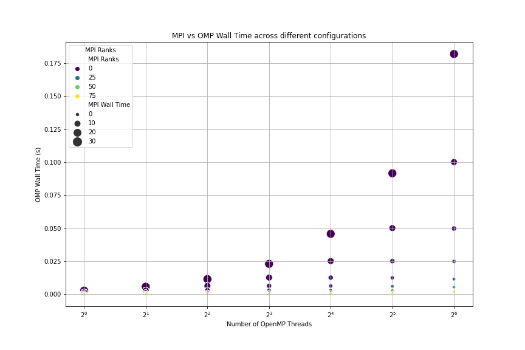
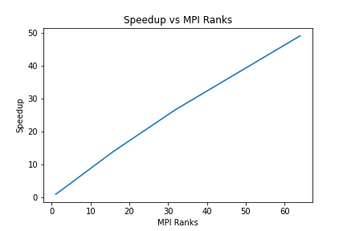
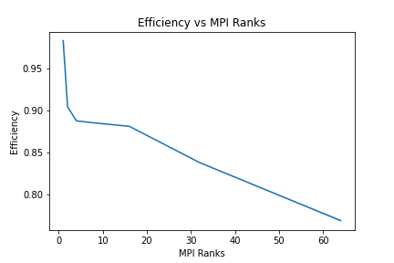
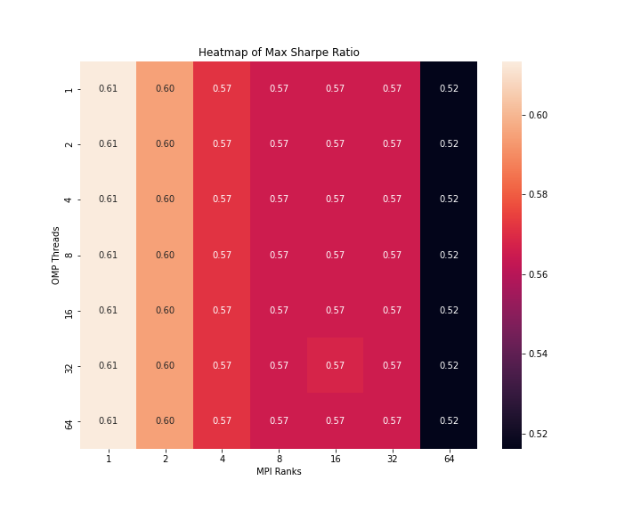

# Portfolio Optimization Using Parallel Computing

##  Introduction

This project is meant to answer the age old question: how can one be financially stable throughout gradaute school? Portfolios are an aggregate of various stock holdings. In the creation of a stock, one must consider the tradeoff between risk and return. Portfolios can range from consisting of treasury bonds which have nearly guaranteed returns with low interest to being comprised of cryptocurrencies, penny stocks, and other excessively volatile holdings that can yield very large returns. However, there is always a tradeoff betwen the risk and return of a stock due to the inherent volatility of its price. Any individual that creates a portfolio must choose which stocks to hold as well as what percentage of each stock the portfolio will be comprised of. This project works as follows: picking any stock subset of stocks witihin the S&P 500 and a risk they want to incur by investing, I calculate the optimal percentages of each stock within the portfolio.

The core objective is to determine the optimal allocation of assets within a portfolio that aligns with a specified risk threshold. This involves a computational process where multiple potential portfolios are synthesized, and their respective Sharpe ratios are calculated. The optimal portfolio is the one that yields the highest Sharpe ratio, signifying the most favorable risk-adjusted return.

Given the stochastic nature of financial markets, Monte Carlo simulations are employed to forecast the return distributions of the selected assets. This probabilistic approach requires substantial computational resources, particularly when analyzing a large dataset like the S&P 500. To address this, the project adopts parallel computing techniques, utilizing both Message Passing Interface (MPI) for inter-node communication and OpenMP for intra-node parallelism. This hybrid parallelism facilitates a more efficient exploration of the portfolio space, significantly reducing computation time and enhancing the capability to manage large-scale data processing in portfolio optimization.

##  Methods

### Data Preprocessing

Before running through portfolio optimization, stocks need to be chosen from the S&P 500 and their data collected in a useful manner. Utilizing the `sp500_data.csv` file, the necessary historical data was aggregated. The preprocessing steps, executed in the `portfolio.ipynb` notebook, included cleansing of the data by handling missing values, normalizing date-time formats, and adjusting for time zone discrepancies. The resulting clean dataset was stored in the `adj_close_df.csv file`, setting the stage for further computational analysis.

### Portfolio Optimization Strategy / Algorithms

The optimization procedure employed a Monte Carlo simulation framework to generate a multitude of potential portfolio weight combinations. This stochastic approach is grounded in the principle of maximizing the Sharpe ratio, a metric that equates the excess return of the portfolio over the risk-free rate to the portfolio's standard deviation.

#### Volatility
Volatility was computed as the annualized standard deviation of the logarithmic returns of the portfolio, serving as a fundamental measure of the risk associated with the portfolio's investment. This metric captures the extent of the variation in returns over time, offering investors insights into the potential for unexpected financial outcomes. Higher volatility indicates greater risk and uncertainty, while lower volatility suggests a more stable investment trajectory.

#### Log returns
Logarithmic returns, derived from the natural logarithm of the ratio of consecutive closing prices, were used due to their symmetrical properties and additive nature over time, which facilitates the analysis of compounded returns. These returns provide a continuous measure that is particularly suited for the geometric aggregation of investment performance across time, crucial for assessing historical performance trends and constructing predictive models.

#### Covariance Matrix
The covariance matrix was a vital component in quantifying the extent to which different assets within the portfolio move together. By analyzing the pairwise covariances between stocks, the matrix offers a nuanced view of the interconnectedness of asset price movements. This insight is instrumental in constructing a diversified portfolio, where the aim is to include assets with low or negative covariances to reduce overall risk. A well-calibrated covariance matrix is essential for the accurate estimation of portfolio volatility and, by extension, the Sharpe ratio.

#### Sharpe ratio
The Sharpe ratio is a dimensionless index that provides a snapshot of the portfolio's performance by comparing its excess returns over the risk-free rate to its volatility. A higher Sharpe ratio signifies a more attractive risk-adjusted return, indicating that investors are receiving more return per unit of risk. The maximization of the Sharpe ratio thus directs the optimization process, steering the selection towards a portfolio composition that promises the most favorable reward-to-variability balance.

#### Estimated Annual Returns
Estimated annual returns were projected by annualizing the mean of log returns. This process extrapolates the expected return of the portfolio over a year, furnishing investors with a key indicator of potential investment performance. This forward-looking measure, while based on historical data, is critical for strategic planning and aligns with long-term investment goals, providing a benchmark against which actual future returns can be compared.

### Parallel Computing Implementation:

There are two forms of parallelism used throughout this project: OpenMP and MPI. 

#### MPI - Distributed Memory Parallelism
MPI was utilized to manage communication between processes across different nodes in a distributed memory environment. This approach was critical for handling the large data volumes of stock prices and enabling simultaneous computations on multiple nodes.

##### Data Distribution
The S&P 500 stock data, once loaded into the master node, was distributed across all available nodes using the broadcastMatrix function. This function ensured that each worker node received a complete set of the stock data to perform computations locally. The broadcasting involved sharing the dimensions of the matrix followed by the actual data, ensuring that all nodes held identical copies for analysis.

##### Task Allocation Strategy
The total number of portfolio simulations (numPortfolios) was evenly split among the available MPI ranks:

$$ \text{Portfolios per MPI rank} =
\frac{\text{Total Portfolios}}{\text{MPI World Size}}
$$
This division ensured that each MPI process was responsible for a manageable chunk of the total workload, leading to more efficient parallel execution.

##### Data Collection
After local computations, results from each node, such as Sharpe ratios, weights, and confidence intervals, were gathered back to the master node using MPI_Gather. This collective communication operation ensured that the final results were aggregated efficiently, allowing for subsequent data analysis and storage.

#### OpenMP - Shared Memory Parallelism
OpenMP was employed within each node to further parallelize the computation by dividing the workload among multiple threads. This allowed for the simultaneous processing of multiple portfolio simulations on each node, optimizing CPU usage and reducing computation time.

###### Dynamic Work Distribution
The pragma omp parallel for directive, coupled with dynamic scheduling, was used to distribute the Monte Carlo simulations among available threads dynamically. This acted as a form of load balancing, by ensuring that all threads were busy throughout the duration of the simulation.
This ensured balanced workload distribution, preventing any single thread from becoming a bottleneck due to uneven task sizes.

##### Thread-Level Optimization
Each thread independently computed portfolio metrics such as expected returns, volatility, and the Sharpe ratio for a subset of portfolios. By normalizing weights within each thread and calculating corresponding performance metrics, the system maximized the use of multicore architectures within each node.

### Runtime Procedures

The SLURM script `run.sb` executed the simulations across various MPI ranks and OpenMP threads in order to enquire about the scaling properties of the computational approach, adjusting the number of processes and threads to evaluate the performance across different parallel configurations.

All simulation outputs were stord in the `simulation_results.csv` file, including key metrics such as the maximum Sharpe ratio, optimal portfolio weights, confidence intervals, and execution times.

### Data Postprocessing

The data amassed in `simulation_results.csv` constituted the basis for all subsequent analyses and visualizations.

## Results

The implementation of parallel computing approaches in this project has yielded quantifiable improvements in the efficiency and performance of portfolio optimization simulations. Utilizing both MPI and OpenMP, the system was tasked with computing the optimal distribution of weights across 10,000 simulated portfolios, each representing a unique investment strategy within the constraints of the specified risk-free rate and trading days.

### Distribution of Max Sharpe Ratios
The Sharpe ratio is a critical measure used to assess the risk-adjusted return of an investment portfolio. Our simulations produced a diverse range of Sharpe ratios, highlighting the potential for different risk-return balances. The distribution of these ratios informs us about the most likely outcomes one can expect when selecting a portfolio at random from the simulation set.

### Scaling Analyses
Scaling studies were a focal point of the project, demonstrating the effects of varying the number of MPI ranks and OpenMP threads on the computational performance. Both strong and weak scaling were examined to understand the scalability of our parallelized portfolio optimization process.

#### Strong Scaling
With a fixed problem size, increasing the number of MPI ranks showed a decrease in wall time, illustrating how distributing the workload across more processors can speed up the computation. However, the benefits diminish as the ranks increase, indicating a point of optimal parallel efficiency.

#### Weak Scaling
Holding the workload per processor constant while increasing the number of processors, we observed a slight increase in the average wall time. This suggests that the additional overhead of coordinating more processors slightly impacts performance but remains within an acceptable efficiency range.

### MPI vs. OpenMP Wall Time
By plotting MPI Wall Time against OpenMP Wall Time across different configurations, we discerned the interplay between MPI and OpenMP in influencing execution time. As expected, there is a trade-off between MPI process distribution and OpenMP thread-level parallelism, suggesting a fine balance is key to optimal performance.

### Speedup and Efficiency
The speedup graph confirmed that as we increased MPI ranks, our program executed faster, showcasing the benefits of parallel computation. Nonetheless, the efficiency graph indicated that increasing ranks also led to a reduction in parallel efficiency, reflecting the complexity and overhead associated with managing more parallel processes.

In summary, the results from this project emphasize the importance of parallel computing in financial modeling and analysis. Through careful calibration of MPI and OpenMP parameters, we achieved substantial reductions in computation time without sacrificing accuracy, thereby facilitating more effective portfolio optimization and management.

### Computational Efficiency and Performance Gains:
The parallel computing approach slashed the overall computational time, showcasing efficiency gains, particularly when analyzing the scaling impact on large portfolio sets.

### Impact on Portfolio Optimization Outcomes:
The optimized portfolios, surfaced through these simulations, shed light on potential investment strategies, providing valuable insights for risk-averse and risk-tolerant investors alike.

## Verification

To verify that the parallel implementation is correct, one can check the max Sharpe ratio and the optimal weights for the serial codes `portfolio.cpp` or `portfolio.ipynb` with those of the parallel code. Unfortunately, the verification tests showed an issue with the implemnetation of one of the parallel implementations, MPI, as seen below:

The broadcasting of the adjusted closing data to all nodes led to an issue that unfortunately led to a poorer result of the program.

## Conclusions

This project showed how the implementation of parallel computing into the calculation of portfolio optimization can drastically speed up its computation. From a parallel perspective, this project demonstrated the utility of OpenMP and MPI in computational finance. While from a financial perspective, it demonstrated how much optimizing a stock portfolio can increase one's holdings over time. Last, but definitely not least, I now know how to gain financial stability as a broke graduate student. Now I just need to find some spare capital.